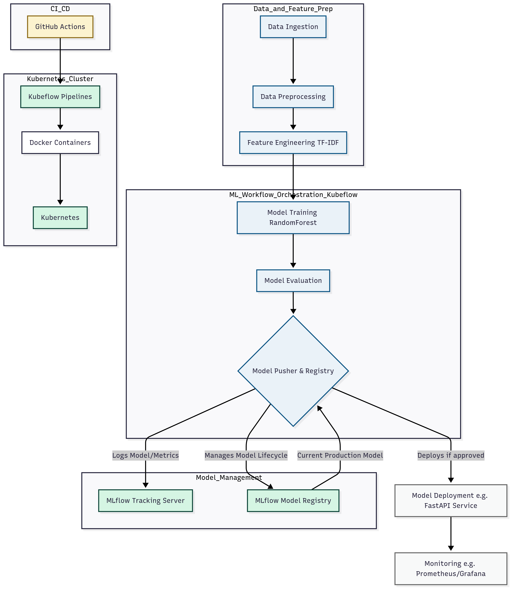
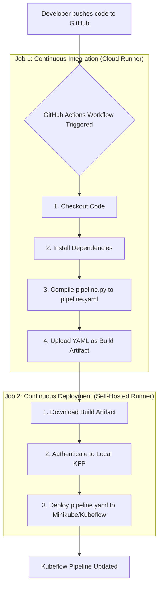

# End-to-End MLOps Pipeline for Spam Detection with Kubeflow & MLflow

[](https://opensource.org/licenses/MIT)
[](https://www.google.com/search?q=https%27www.python.org/downloads/release/python-3100/)
[](https://www.google.com/search?q=https://github.com/PrakashD2003/Kubeflow-Study/actions/workflows/main.yaml)

### Project Overview

This repository contains a production-grade, end-to-end MLOps pipeline designed to automate the entire lifecycle of an SMS spam detection model. The project leverages **Kubeflow Pipelines** for robust orchestration, with each step running as a self-contained **Docker** container.

A key feature of this project is its sophisticated model governance and deployment strategy. By integrating with **MLflow** and **DagsHub**, the pipeline not only tracks every experiment but also implements an automated **champion/challenger promotion system**. A newly trained model is automatically compared against the current production model, and it is only promoted if it meets a configurable performance improvement threshold, ensuring that only superior models make it to production.

-----

## ✨ Key Features

  * **End-to-End Orchestration**:

      * Utilizes **Kubeflow Pipelines** to define and manage the entire ML workflow as a directed acyclic graph (DAG).
      * Automates the flow of data artifacts between components, from raw data to the final registered model.

  * **Containerized & Modular Components**:

      * Each pipeline step (e.g., data ingestion, training) is packaged as a separate **Docker** container.
      * This ensures a consistent execution environment, eliminates dependency conflicts, and makes the pipeline highly portable and scalable.
        
  * **Intelligent Model Promotion**:

      * Implements an automated champion/challenger strategy using a dedicated **`Model Pusher`** component.
      * Automatically fetches the current production model from the **MLflow Model Registry**.
      * Promotes a new model to "Production" only if its primary metric (e.g., accuracy) surpasses the production model's metric by a configurable `improvement_threshold`.
      * Models that do not meet the threshold are safely registered in "Staging" for manual review.
        
  * **Full CI/CD for MLOps**:
      * **Continuous Integration**: The GitHub Actions workflow automatically compiles and validates the Kubeflow pipeline definition on every push to `main`.
      * **Continuous Deployment**: A second job in the workflow uses a **self-hosted runner** to automatically deploy the compiled pipeline to a local or private Kubernetes (Minikube) cluster, completing the                                        automation loop.

  * **Secure Credential Management**:

      * Follows security best practices by passing DagsHub credentials as runtime parameters to the pipeline.
      * This avoids hardcoding secrets in source code, preventing accidental exposure. A detailed guide is available in **[SECURITY\_GUIDE.md](https://www.google.com/search?q=SECURITY_GUIDE.md)**.

  * **Automated CI Workflow**:

      * Integrates **GitHub Actions** to automatically compile the Kubeflow pipeline definition (`pipeline.py` -\> `pipeline.yaml`) on every push to the `main` branch.
      * The compiled YAML is uploaded as a build artifact, ensuring a validated, deployable asset is always available.

-----

## 🏛️ Pipeline Architecture

This project implements a complete, automated MLOps workflow composed of six containerized components orchestrated by Kubeflow.

`Data Ingestion` **➔** `Data Preprocessing` **➔** `Feature Engineering` **➔** `Model Training` **➔** `Model Evaluation` **➔** `Model Pusher & Registry`

1.  **Data Ingestion**: Fetches the raw SMS dataset, performs initial cleaning (e.g., renaming/dropping columns), and splits it into training and testing sets.
2.  **Data Preprocessing**: Applies NLP text transformations, including lowercasing, stopword removal, stemming, and label encoding.
3.  **Feature Engineering**: Converts the cleaned text data into numerical features using a `TfidfVectorizer`.
4.  **Model Training**: Trains a `RandomForestClassifier` on the TF-IDF features, using hyperparameters from a central configuration file.
5.  **Model Evaluation**: Evaluates the trained model on the test set and calculates key performance metrics such as Accuracy, Precision, Recall, and AUC.
6.  **Model Pusher**: The intelligence hub of the pipeline. This component:
      * Logs the new model's parameters and metrics to MLflow.
      * Fetches the metrics of the current model in the "Production" stage from the MLflow Model Registry.
      * **Compares the new model against the production model.**
      * If the new model shows sufficient improvement (based on a configurable threshold in `params.yaml`), it archives the old production model and promotes the new one to "Production".
      * If the new model does not meet the threshold, it is registered in the "Staging" stage for review.


-----
## 🏛️ CI/CD and Deployment Architecture

The project demonstrates a complete GitOps-style workflow for MLOps.



-----

## 🛠️ Tech Stack

| Category                            | Technologies                                                                                                                                                                                                                               |
| ----------------------------------- | ------------------------------------------------------------------------------------------------------------------------------------------------------------------------------------------------------------------------------------------ |
| **Orchestration & Platform** | Kubeflow Pipelines, Kubernetes                                                                                                                                                                                                             |
| **Experiment Tracking & MLOps** | MLflow, DagsHub                                                                                                                                                           |
| **Containerization & CI/CD** | Docker, GitHub Actions                                                                                                                                                                                                                     |
| **Data Science & Machine Learning** | Scikit-learn, Pandas, NLTK                                                                                                                                                                  |
| **Core Technologies** | Python, YAML                                                                                                                                                                                                                          |

-----

## 📂 Repository Structure

| Path                                                                                                       | Description                                                                                                   |
| ---------------------------------------------------------------------------------------------------------- | ------------------------------------------------------------------------------------------------------------- |
| [`pipeline.py`](https://www.google.com/search?q=%5Bhttps://github.com/PrakashD2003/Kubeflow-Study/blob/main/pipeline.py%5D\(https://github.com/PrakashD2003/Kubeflow-Study/blob/main/pipeline.py\))                         | The main Kubeflow DSL pipeline definition. Compiles to `spam_detection_pipeline.yaml`.                       |
| [`spam_detection_pipeline.yaml`](https://www.google.com/search?q=%5Bhttps://github.com/PrakashD2003/Kubeflow-Study/blob/main/spam_detection_pipeline.yaml%5D\(https://github.com/PrakashD2003/Kubeflow-Study/blob/main/spam_detection_pipeline.yaml\)) | The compiled pipeline specification, ready to be uploaded to Kubeflow.                                        |
| [`params.yaml`](https://www.google.com/search?q=%5Bhttps://github.com/PrakashD2003/Kubeflow-Study/blob/main/params.yaml%5D\(https://github.com/PrakashD2003/Kubeflow-Study/blob/main/params.yaml\))                         | Centralized configuration for hyperparameters and model promotion thresholds.                                          |
| [`components/`](https://www.google.com/search?q=%5Bhttps://github.com/PrakashD2003/Kubeflow-Study/tree/main/components%5D\(https://github.com/PrakashD2003/Kubeflow-Study/tree/main/components\))                         | Contains the source code and `Dockerfile` for each containerized pipeline component.                          |
| [`.github/workflows/`](https://www.google.com/search?q=%5Bhttps://github.com/PrakashD2003/Kubeflow-Study/tree/main/.github/workflows%5D\(https://github.com/PrakashD2003/Kubeflow-Study/tree/main/.github/workflows\))            | Contains the GitHub Actions CI workflow for automated pipeline compilation.                                  |
| [`SECURITY_GUIDE.md`](https://www.google.com/search?q=%5Bhttps://github.com/PrakashD2003/Kubeflow-Study/blob/main/SECURITY_GUIDE.md%5D\(https://github.com/PrakashD2003/Kubeflow-Study/blob/main/SECURITY_GUIDE.md\))           | A detailed guide on the secure handling of credentials within the pipeline.                                        |

-----

## 🚀 How to Run

### Prerequisites

* A running Kubernetes cluster with Kubeflow Pipelines installed.
    * *For local development, this can be easily set up using tools like **Minikube**.*
* Docker installed and running on your local machine.
* A DagsHub account and a repository configured for MLflow tracking.
* (Optional, for CD) A self-hosted GitHub runner configured for your repository with access to your Kubernetes cluster.


### Steps

### 1\. Build & Push Component Images

Each component in the `components/` directory has its own `Dockerfile`. You need to build and push an image for each one to a container registry (e.g., Docker Hub).

```bash
# Example for the data-ingestion component
docker build -f components/data-ingestion/Dockerfile.ingestion -t <your-registry>/kubeflow-ingest:v1 .
docker push <your-registry>/kubeflow-ingest:v1

# Repeat for all 6 components...
```

**Note:** Ensure the image names in `pipeline.py` are updated to point to your registry.

### 2\. Configure Parameters

Review and edit the `params.yaml` file to set hyperparameters for the pipeline, especially the `model_comparison` section to define your promotion criteria.

### 3\. Compile the Pipeline

Run the pipeline definition script to generate the compiled YAML file that will be uploaded to Kubeflow.

```bash
python pipeline.py
```

This will create `spam_detection_pipeline.yaml`.

### 4\. Deploy to Kubeflow

You can deploy the pipeline using either the Kubeflow UI or the SDK.

**Using the Kubeflow UI (Recommended for Security):**

1.  Navigate to your Kubeflow dashboard and upload `spam_detection_pipeline.yaml`.
2.  Create a new run from the uploaded pipeline.
3.  **Crucially, you must override the default pipeline parameters** to provide your DagsHub credentials and repository information securely at runtime.
      * `dagshub_username`
      * `dagshub_token`
      * `repo_owner_name`
      * `repo_name`

**Using the Kubeflow SDK:**

You can programmatically launch a run and pass your credentials as parameters.

-----

## 🔬 Detailed Pipeline Breakdown

  * **Data Ingestion**: Loads the SMS dataset from a URL, drops unnecessary columns (`Unnamed: 2`, `3`, `4`), renames `v1` to `target` and `v2` to `text`, and splits the data into train/test sets based on `test_size` in `params.yaml`.
  * **Data Preprocessing**: Applies `LabelEncoder` to the target column, removes duplicate rows, and cleans the text by lowercasing, tokenizing, removing stopwords/punctuation, and applying `PorterStemmer`.
  * **Feature Engineering**: Uses `TfidfVectorizer` to convert the preprocessed text into numerical feature vectors, limiting the vocabulary size with `max_features` from `params.yaml`.
  * **Model Training**: Trains a `RandomForestClassifier` using `n_estimators` defined in `params.yaml` and saves the serialized model as a `.pkl` artifact.
  * **Model Evaluation**: Loads the trained model and test data to compute **Accuracy, Precision, Recall, and AUC**, saving the results to a `metrics.json` file.
  * **Model Pusher**: This final, critical step connects to DagsHub/MLflow. It logs the new model and its metrics. It then fetches the current production model's `primary_metric` (e.g., 'accuracy'). If the new model's metric is greater than the production metric by the specified `improvement_threshold`, it archives the old model and promotes the new one to the "Production" stage. Otherwise, the new model is registered in "Staging".

-----
## 📄 License

This project is licensed under the MIT License. See the [LICENSE](https://www.google.com/search?q=LICENSE) file for details.


